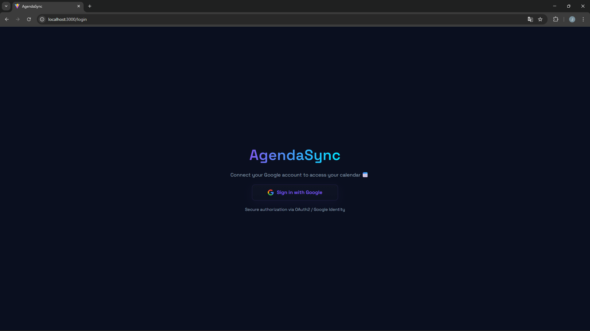
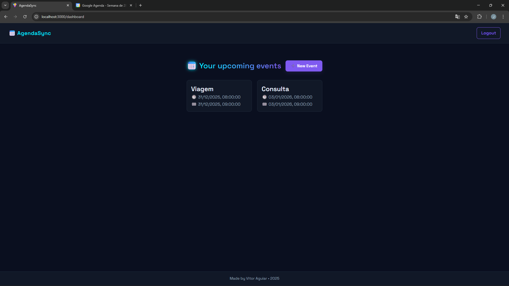
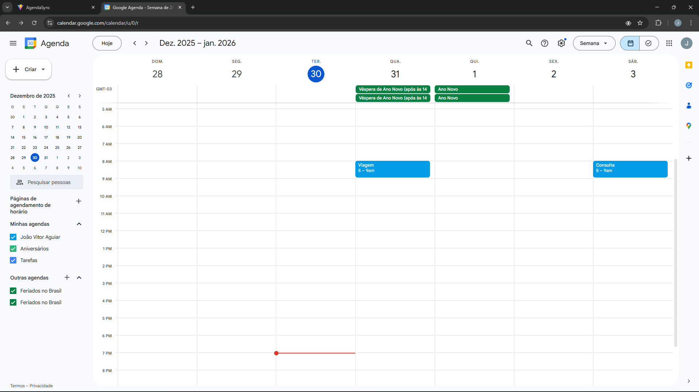
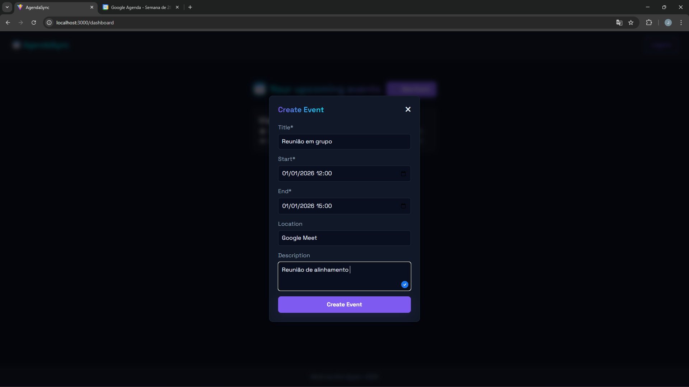
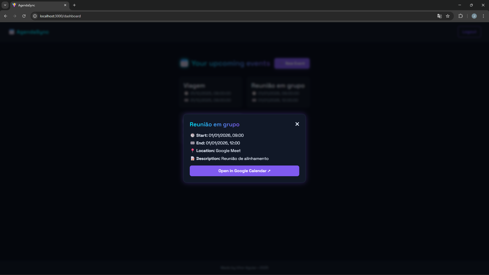

# **AgendaSync** 📅

**Web app to create and manage events synchronized with Google Calendar via OAuth2.**

<div style="display: flex; gap: 10px; flex-wrap: wrap; margin-top:10px;">
  
  
  
  
  
  
</div>

---

## 📸 **User Flow**

> Below is the step-by-step flow of using AgendaSync — from logging in to creating and synchronizing events with Google Calendar.

### 1️⃣ **Google Login**

The user starts by authenticating via OAuth2 with Google.


---

### 2️⃣ **Dashboard Overview**

After logging in, the user can view all synchronized events.


---

### 3️⃣ **Google Calendar (Before Creation)**

Before creating a new event, the Google Calendar has no record of it yet.


---

### 4️⃣ **Create a New Event**

The user fills in the event details and submits it to Google Calendar.


---

### 5️⃣ **Google Calendar (After Creation)**

The newly created event now appears in Google Calendar as well.


---

### 6️⃣ **Event Details on Dashboard**

Users can also inspect the event details directly within the dashboard.



## 📌 **Features**

* Google Login via OAuth2 (Auth Code Flow)
* Create and list events from Google Calendar
* JWT Authentication with .NET
* Containerized full stack (PostgreSQL + API + Web App)
* Automatic EF Core migrations on startup
* `.env` configuration support 

---

## 🐳 **Running with Docker**

### 1️⃣ Create your `.env` file

Copy the example and configure values:

```sh
cp .env.example .env
```

---

### 2️⃣ Build & run containers

```sh
docker compose --env-file .env up --build
```

---

### 📍 Accessing the app

| Service    | URL                                            |
| ---------- | ---------------------------------------------- |
| Frontend   | [http://localhost:3000](http://localhost:3000) |
| API        | [http://localhost:5069](http://localhost:5069) |
| PostgreSQL | localhost:5432                                 |

---

### 🔧 Useful commands

| Action                  | Command                      |
| ----------------------- | ---------------------------- |
| Stop containers         | `docker compose down`        |
| Stop + remove DB volume | `docker compose down -v`     |
| Show logs from API      | `docker compose logs -f api` |


---

## 🔧 Folder Structure

```
AgendaSync/
├── api/              # .NET backend
├── app/              # React + Vite frontend
├── docker-compose.yml
├── .env.example
└── README.md
```

---

## 🔐 Security Notes

* ⚠️ Never commit `.env` or real secrets to Git
* Use a strong `JWT_SECRET` in production
* Configure Google OAuth correctly in Google Cloud Console:

  * **Authorized JavaScript origins:** frontend URL (localhost or production domain)
  * **Authorized redirect URIs:** your API OAuth callback

---

## 🐛 Troubleshooting

| Issue                                      | Fix                                               |
| ------------------------------------------ | ------------------------------------------------- |
| Migration race conditions                  | Delete volume + restart: `docker compose down -v` |
| Google OAuth error `redirect_uri_mismatch` | Update Redirect URL in Google Cloud Console       |
| Frontend `.env` not applying               | Rebuild: `docker compose build web_app`           |

